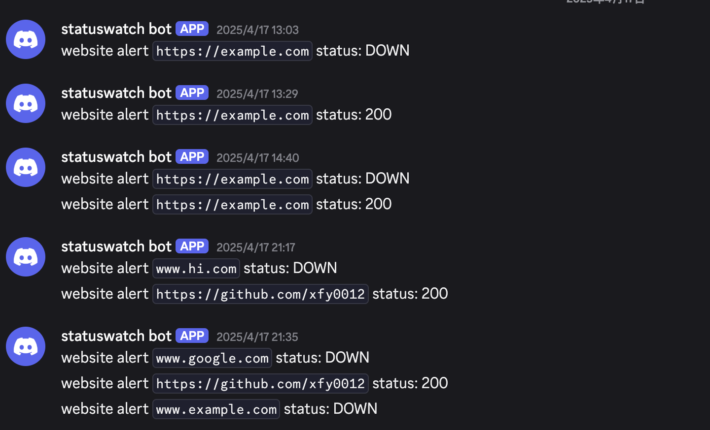

<!-- Improved compatibility of back to top link: See: https://github.com/othneildrew/Best-README-Template/pull/73 -->
<a id="readme-top"></a>
<!--
*** Thanks for checking out the Best-README-Template. If you have a suggestion
*** that would make this better, please fork the repo and create a pull request
*** or simply open an issue with the tag "enhancement".
*** Don't forget to give the project a star!
*** Thanks again! Now go create something AMAZING! :D
-->


<!-- PROJECT SHIELDS -->
<!--
*** I'm using markdown "reference style" links for readability.
*** Reference links are enclosed in brackets [ ] instead of parentheses ( ).
*** See the bottom of this document for the declaration of the reference variables
*** for contributors-url, forks-url, etc. This is an optional, concise syntax you may use.
*** https://www.markdownguide.org/basic-syntax/#reference-style-links
-->
[![Contributors][contributors-shield]][contributors-url]
[![Forks][forks-shield]][forks-url]
[![Stargazers][stars-shield]][stars-url]
[![Issues][issues-shield]][issues-url]
[![project_license][license-shield]][license-url]


<!-- PROJECT LOGO -->
<br />
<div align="center">
  <!-- <a href="https://github.com/github_username/repo_name">
    
  </a> -->

<h3 align="center">Status-Watcher-</h3>

  <p align="center">
    Website uptime checker with scheduled scans and Discord notifications
    <br />
    <!-- <a href="https://github.com/xfy0012/Status-Watcher-"><strong>Explore the docs »</strong></a> -->
    <br />
    <br />
    <a href="https://github.com/xfy0012/Status-Watcher-">View Demo</a>
    &middot;
    <a href="https://github.com/xfy0012/Status-Watcher-/issues/new?labels=bug&template=bug-report---.md">Report Bug</a>
    &middot;
    <a href="https://github.com/xfy0012/Status-Watcher-/new?labels=enhancement&template=feature-request---.md">Request Feature</a>
  </p>
</div>


<!-- TABLE OF CONTENTS -->
<details>
  <summary>Table of Contents</summary>
  <ol>
    <li>
      <a href="#about-the-project">About The Project</a>
      <ul>
        <li><a href="#built-with">Built With</a></li>
      </ul>
    </li>
    <li>
      <a href="#getting-started">Getting Started</a>
      <ul>
        <li><a href="#prerequisites">Prerequisites</a></li>
        <li><a href="#installation">Installation</a></li>
      </ul>
    </li>
    <li><a href="#usage">Usage</a></li>
    <li><a href="#roadmap">Roadmap</a></li>
    <li><a href="#contributing">Contributing</a></li>
    <li><a href="#license">License</a></li>
    <li><a href="#contact">Contact</a></li>
    <li><a href="#acknowledgments">Acknowledgments</a></li>
  </ol>
</details>


<!-- ABOUT THE PROJECT -->
## About The Project

[![Product Name Screen Shot][product-screenshot]](https://example.com)

**Status Watcher** is a lightweight website monitoring tool that helps users track website uptime and receive real-time alerts when downtime occurs.

It periodically checks the availability of registered websites and sends immediate notifications via **Discord** if a site becomes unresponsive.

Built with **Flask**, **SQLite**, and **APScheduler**, the system is easy to deploy and extend. It’s ideal for developers, sysadmins, or small teams looking for a simple, self-hosted monitoring solution without relying on third-party services.

This project also includes optional integration with **Prometheus**, enabling observability of the service’s own runtime performance. This can be useful for debugging, performance tuning, and future optimization as the project evolves.

<p align="right">(<a href="#readme-top">back to top</a>)</p>


### Built With

* [![Python][Python]][Python-url]
* [![Flask][Flask]][Flask-url]
* [![SQLite][SQLite]][SQLite-url]
* [![Bootstrap][Bootstrap]][Bootstrap-url]
* [![Docker][Docker]][Docker-url]
* [![Discord][Discord]][Discord-url]

<p align="right">(<a href="#readme-top">back to top</a>)</p>


<!-- GETTING STARTED -->
## Getting Started
To get a local copy up and running, follow these simple steps.
### Prerequisites

Make sure you have the following installed:
* Python 3.8+ (https://www.python.org/)
  ```sh
  #Check your Python version:

  python --version
  # Python 3.8+ required
  ```
* pip (https://pip.pypa.io/en/stable/)
* Docker & Docker Compose (https://docs.docker.com/compose/)

### Installation

1. Get your Discord Webhook URL <br>
Create a Discord webhook by following [this guide](https://support.discord.com/hc/en-us/articles/228383668-Intro-to-Webhooks),  
and copy the webhook URL (it looks like `https://discord.com/api/webhooks/...`).

2. Clone the repo
   ```sh
   git clone https://github.com/xfy0012/Status-Watcher-.git
   cd status-watcher-
   ```
3. Configure your webhook URL <br>
Open the `.env` file in the project root and replace the placeholder with your actual Discord webhook URL:
   ```py
   DISCORD_WEBHOOK_URL=https://discord.com/api/webhooks/your_webhook_here
   ```
4. Start the application with Docker
   ```sh
   docker-compose up --build
   ```
This will build the image and launch the app on http://localhost:5000.

<p align="right">(<a href="#readme-top">back to top</a>)</p>


<!-- USAGE EXAMPLES -->
## Usage
Once the app is running (via Docker or local), visit: http://localhost:5000

###  From the Web Interface

Add/Delete a website URL (e.g., `https://example.com`)<br>
The app will automatically check its availability every few minutes<br>
If the site is unreachable, you will receive a alert via Discord

### Example Discord Alert



<p align="right">(<a href="#readme-top">back to top</a>)</p>


<!-- ROADMAP -->
## Roadmap
### Core Features (Completed)
- [x] GitHub OSS Setup
  - [x] LICENSE
  - [x] README.md
  - [x] .gitignore
  - [x] PR & Issue templates
- [x] Core App Functionality
  - [x] Website uptime checker
  - [x] Discord webhook alert integration
  - [x] Admin web interface (add/delete URLs)
  - [x] Docker & Docker Compose support
- [x] Basic Status Dashboard (HTML + Bootstrap)
  - [x] Display website status
  - [x] Show last checked time
- [x] Observability & Monitoring
  - [x] Prometheus metrics endpoint
  - [x] Grafana dashboard integration

### Planned
- [ ] Async Monitoring
  - [ ] Refactor checker using `httpx.AsyncClient`
  - [ ] Improve concurrency performance for multiple sites
- [ ] Dashboard Enhancements
  - [ ] Uptime trend or response time chart
  - [ ] Filterable view for site status
- [ ] Notification Integrations
  - [ ] Email alert support
  - [ ] Slack or Telegram integration 


See the [open issues](https://github.com/xfy0012/Status-Watcher-/issues) for a full list of proposed features (and known issues).

<p align="right">(<a href="#readme-top">back to top</a>)</p>


<!-- CONTRIBUTING -->
## Contributing

Contributions are what make the open source community such an amazing place to learn, inspire, and create. Any contributions you make are **greatly appreciated**.

If you have a suggestion that would make this better, please fork the repo and create a pull request. You can also simply open an issue with the tag "enhancement".
Don't forget to give the project a star! Thanks again!

1. Fork the Project
2. Create your Feature Branch (`git checkout -b feature/AmazingFeature`)
3. Commit your Changes (`git commit -m 'Add some AmazingFeature'`)
4. Push to the Branch (`git push origin feature/AmazingFeature`)
5. Open a Pull Request

<p align="right">(<a href="#readme-top">back to top</a>)</p>

### Top contributors:

<a href="https://github.com/github_username/repo_name/graphs/contributors">
  
</a>


<!-- LICENSE -->
## License

Distributed under the project_license. See `LICENSE.txt` for more information.

<p align="right">(<a href="#readme-top">back to top</a>)</p>


<!-- CONTACT
## Contact

Your Name - [@twitter_handle](https://twitter.com/twitter_handle) - email@email_client.com

Project Link: [https://github.com/github_username/repo_name](https://github.com/github_username/repo_name)

<p align="right">(<a href="#readme-top">back to top</a>)</p> -->


<!-- ACKNOWLEDGMENTS
## Acknowledgments

* []()
* []()
* []() -->
<!-- 
<p align="right">(<a href="#readme-top">back to top</a>)</p> -->


<!-- MARKDOWN LINKS & IMAGES -->
<!-- https://www.markdownguide.org/basic-syntax/#reference-style-links -->
[contributors-shield]: https://img.shields.io/github/contributors/xfy0012/Status-Watcher-.svg?style=for-the-badge
[contributors-url]: https://github.com/xfy0012/Status-Watcher-/graphs/contributors

[forks-shield]: https://img.shields.io/github/forks/xfy0012/Status-Watcher-.svg?style=for-the-badge
[forks-url]: https://github.com/xfy0012/Status-Watcher-/network/members


[stars-shield]: https://img.shields.io/github/stars/xfy0012/Status-Watcher-.svg?style=for-the-badge
[stars-url]: https://github.com/xfy0012/Status-Watcher-/stargazers


[issues-shield]: https://img.shields.io/github/issues/xfy0012/Status-Watcher-.svg?style=for-the-badge
[issues-url]: https://github.com/xfy0012/Status-Watcher-/issues


[license-shield]: https://img.shields.io/github/license/xfy0012/Status-Watcher-.svg?style=for-the-badge
[license-url]: https://github.com/xfy0012/Status-Watcher-/blob/main/LICENSE


<!-- Improved compatibility of back to top link: See: https://github.com/othneildrew/Best-README-Template/pull/73 -->
<a id="readme-top"></a>
<!--
*** Thanks for checking out the Best-README-Template. If you have a suggestion
*** that would make this better, please fork the repo and create a pull request
*** or simply open an issue with the tag "enhancement".
*** Don't forget to give the project a star!
*** Thanks again! Now go create something AMAZING! :D
-->


<!-- PROJECT SHIELDS -->
<!--
*** I'm using markdown "reference style" links for readability.
*** Reference links are enclosed in brackets [ ] instead of parentheses ( ).
*** See the bottom of this document for the declaration of the reference variables
*** for contributors-url, forks-url, etc. This is an optional, concise syntax you may use.
*** https://www.markdownguide.org/basic-syntax/#reference-style-links
-->
[![Contributors][contributors-shield]][contributors-url]
[![Forks][forks-shield]][forks-url]
[![Stargazers][stars-shield]][stars-url]
[![Issues][issues-shield]][issues-url]
[![project_license][license-shield]][license-url]


