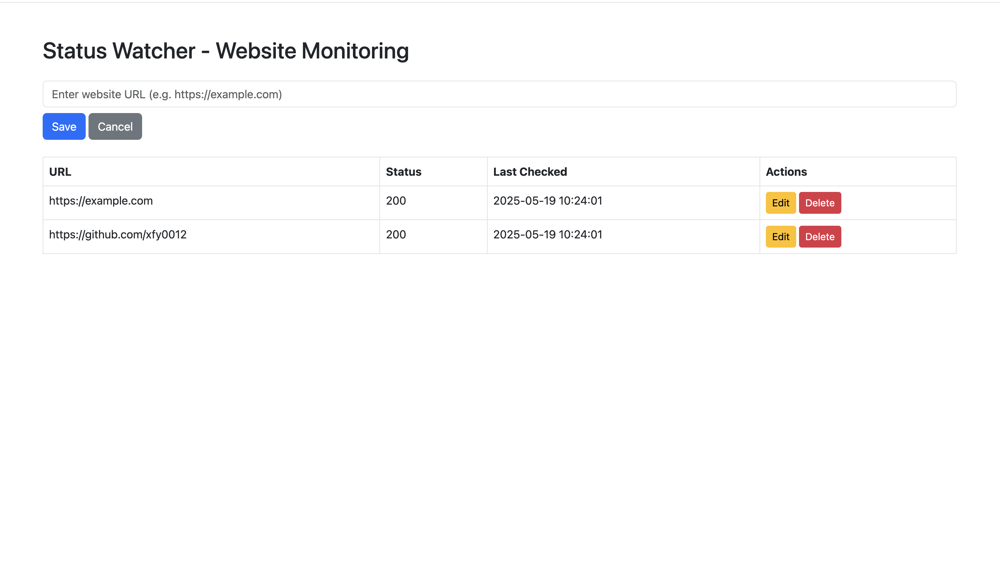

# Status-Watcher-

[![Contributors][contributors-shield]][contributors-url]
[![Forks][forks-shield]][forks-url]
[![Stargazers][stars-shield]][stars-url]
[![Issues][issues-shield]][issues-url]
[![project_license][license-shield]][license-url]

---

## About The Project



**Status Watcher** is a lightweight website monitoring tool that periodically checks website availability and sends real-time notifications via Discord when downtime is detected. The project is built with **Flask**, **SQLite**, and **APScheduler**, and optionally integrates with **Prometheus** and **Grafana** for observability.

- Manage monitored websites via a Web UI
- One-click deployment with Docker
- Prometheus metrics collection and Grafana visualization
- Real-time alerts via Discord Webhook

---

## Features
- Periodic website availability checks
- Real-time Discord notifications
- Web UI for CRUD operations on monitored sites
- Prometheus metrics (status code, response time, status changes)
- Grafana dashboard integration

---

## Built With
* [Python](https://www.python.org/)
* [Flask](https://flask.palletsprojects.com/)
* [SQLite](https://www.sqlite.org/)
* [Bootstrap](https://getbootstrap.com/)
* [Docker](https://www.docker.com/)
* [Prometheus](https://prometheus.io/)
* [Grafana](https://grafana.com/)
* [Discord Webhook](https://discord.com/developers/docs/resources/webhook)

---

## Getting Started

### Environment Setup
Before running the project, create a `.env` file in the project root directory and add your Discord webhook URL:

```env
DISCORD_WEBHOOK_URL=https://discord.com/api/webhooks/your_webhook_id/your_webhook_token
```

### Prerequisites
- Python 3.8+
- pip
- Docker & Docker Compose

### Local Installation
```bash
# Clone the repository
git clone https://github.com/xfy0012/Status-Watcher-.git
cd Status-Watcher-
# Install dependencies
pip install -r requirements.txt
# Start the service
python run.py
```
Visit: http://localhost:5000

### Docker Compose (Recommended)
```bash
docker-compose up --build
```
- Web UI: [http://localhost:5050](http://localhost:5050)
- Prometheus: [http://localhost:9090](http://localhost:9090)
- Grafana: [http://localhost:3000](http://localhost:3000)

---

## Testing

This project includes automated tests for API endpoints and core business logic.

To run all tests, make sure you have installed the dependencies, then run:

```bash
pytest
```

Test coverage includes:
- API endpoints (CRUD for websites)
- Website status checking logic (with mocks)
- Error handling for invalid input and not found resources

Test files are located in the `tests/` directory.

---

## Usage
- Add/delete monitored websites via the Web UI
- The system automatically checks website status on a schedule
- Status changes trigger real-time Discord Webhook notifications
- Prometheus collects monitoring metrics, which can be visualized in Grafana

### API Overview
- `GET /api/websites` Get all monitored websites
- `POST /api/websites` Add a new website
- `PUT /api/websites/<id>` Update a website
- `DELETE /api/websites/<id>` Delete a website

---

## Roadmap & TODO
- [x] Website monitoring and alerting
- [x] Web UI management
- [x] Prometheus & Grafana integration
- [ ] User system and permissions
- [ ] Email/Slack/Telegram notifications
- [ ] More advanced monitoring metrics and reports

---

## Known Issues & Limitations
- All data currently belongs to user_id=1; multi-user and permissions are not implemented
- Discord Webhook must be configured via environment variable
- No API authentication or authorization
- Only HTTP/HTTPS website monitoring is supported

---

## License

Distributed under the MIT License. See `LICENSE` for more information.

---

[contributors-shield]: https://img.shields.io/github/contributors/xfy0012/Status-Watcher-.svg?style=for-the-badge
[contributors-url]: https://github.com/xfy0012/Status-Watcher-/graphs/contributors
[forks-shield]: https://img.shields.io/github/forks/xfy0012/Status-Watcher-.svg?style=for-the-badge
[forks-url]: https://github.com/xfy0012/Status-Watcher-/network/members
[stars-shield]: https://img.shields.io/github/stars/xfy0012/Status-Watcher-.svg?style=for-the-badge
[stars-url]: https://github.com/xfy0012/Status-Watcher-/stargazers
[issues-shield]: https://img.shields.io/github/issues/xfy0012/Status-Watcher-.svg?style=for-the-badge
[issues-url]: https://github.com/xfy0012/Status-Watcher-/issues
[license-shield]: https://img.shields.io/github/license/xfy0012/Status-Watcher-.svg?style=for-the-badge
[license-url]: https://github.com/xfy0012/Status-Watcher-/blob/main/LICENSE


