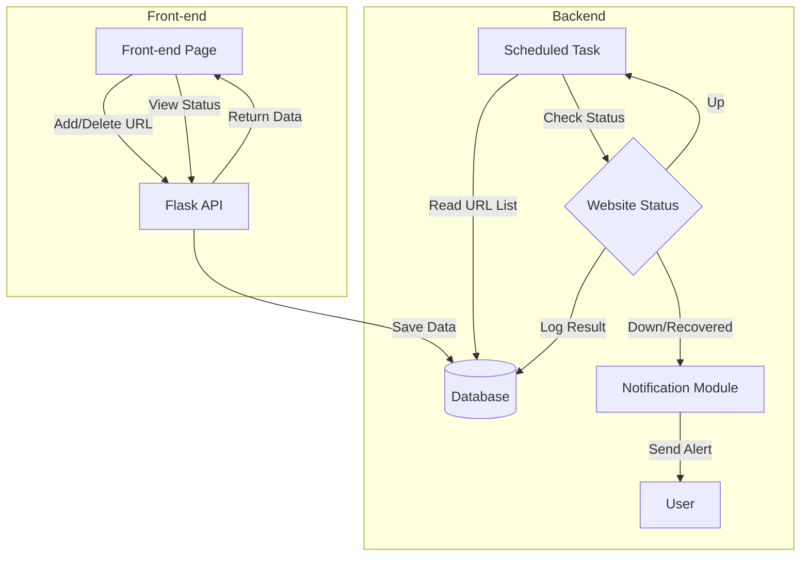
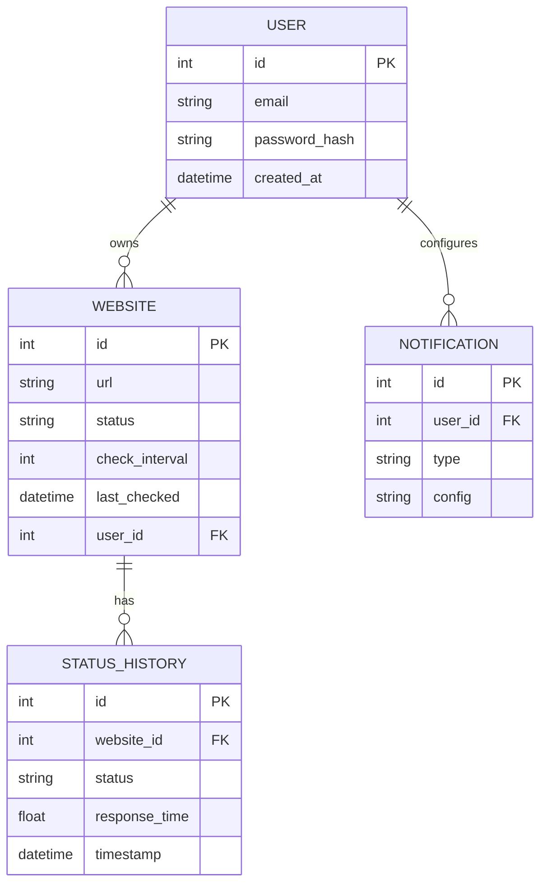

# Status-Watcher

**Status Watcher** is a lightweight website uptime monitoring system built with Flask, Prometheus, and Grafana. It allows users to manage a list of websites via a simple web interface and automatically checks their availability at regular intervals.

The system exposes metrics for Prometheus and can be visualized using Grafana dashboards. The entire stack is containerized using Docker Compose for easy setup and deployment.

## Features
Web UI to **add / update / delete** websites to monitor
Periodic availability checks using **APScheduler**
Exposes Prometheus-compatible metrics at `/metrics`
Integration with **Grafana** for real-time visualization
One-command deployment via **Docker Compose**
Sends **Discord alerts** when a website is down or back online


## Architecture Overview


## ER

##  Prerequisites
Before you begin, make sure you have the following installed:

- [Docker](https://www.docker.com/get-started)
- [Docker Compose](https://docs.docker.com/compose/install/) (usually comes with Docker Desktop)

> You do **not** need to install Python, Flask, or SQLite manually — everything is handled inside the Docker containers.


### 1. Clone the project
git clone https://github.com/your-username/status-watcher.git
cd status-watcher


### 2. Create virtual environment 
python3 -m venv venv
source venv/bin/activate  # macOS/Linux
venv\Scripts\activate     # for Windows

### 3. Install dependencies
Install dependencies

### 4. Run the app
python run.py

### Build & Start the Services
docker-compose build
docker-compose up -d

Access the Services
Web UI (Flask): http://localhost:5050
Prometheus: http://localhost:9090
Grafana: http://localhost:3000

Default Grafana login: admin / admin

How It Works
The Flask app allows you to manage the list of websites to monitor.
A background scheduler checks each website every 60 seconds.
Status and availability are stored in the database.
Prometheus scrapes data from the /metrics endpoint.
Grafana visualizes uptime/downtime over time.

Tech Stack
Backend: Flask, SQLAlchemy, APScheduler
Frontend: HTML, JavaScript, Bootstrap
Monitoring: Prometheus, Grafana
Deployment: Docker, Docker Compose
Database: SQLite

Future Improvements
Save historical status logs for trend analysis
Add email / Slack alerts
Add user authentication
Support persistent database (e.g., PostgreSQL)
Host on cloud server (e.g., AWS, Railway)

---

## Discord Notifications

Status Watcher supports sending real-time alerts to a Discord channel when a monitored website goes **down** or comes **back online**.

### How to Set It Up

1. **Create a Webhook** in your Discord server:
   - Go to a channel → *Edit Channel* → **Integrations** → *Create Webhook*
   - Name it (e.g., `Status Watcher`) and **copy the webhook URL**

2. **Paste the webhook URL into your `.env`:**

```python
DISCORD_WEBHOOK = "https://discord.com/api/webhooks/your_webhook_id"
